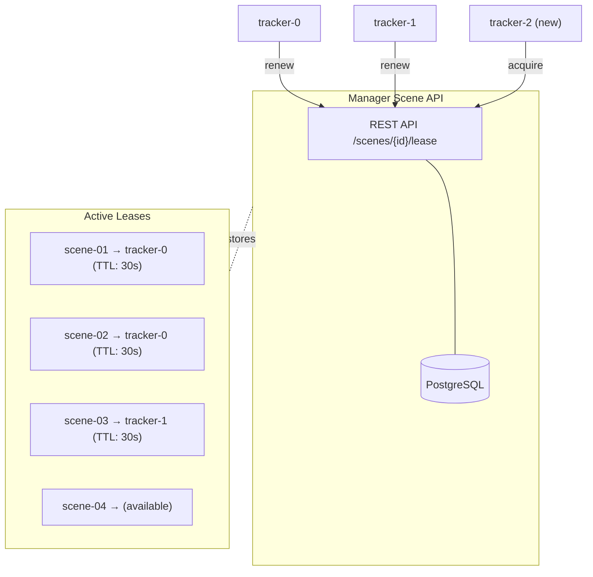

# ADR 8: Tracker Service Horizontal Scaling

- **Author(s)**: [Józef Daniecki](https://github.com/jdanieck)
- **Date**: 2026-01-22
- **Status**: `Proposed`

## Context

The Tracker Service MVP uses **static scene partitioning**: each instance is configured with a fixed set of scene IDs at startup via configuration files. While simple and sufficient for initial deployments, this approach has operational limitations:

- **Manual failover**: When an instance fails, administrators must manually reassign its scenes to other instances
- **Manual scaling**: Adding or removing instances requires configuration changes and restarts across the deployment
- **Configuration management**: Each instance requires unique configuration files mapping scene IDs to that instance
- **Zero-downtime updates**: Rolling updates require careful orchestration to maintain scene coverage

**Industry Context**: Lease-based coordination is a proven pattern for distributed systems. Kubernetes uses [lease objects for leader election](https://kubernetes.io/docs/concepts/architecture/leases/) and [etcd provides TTL-based leases](https://etcd.io/docs/latest/learning/api/#lease-api) for distributed coordination.

## Decision

Implement **lease-based dynamic scaling** where Tracker Service instances automatically acquire and maintain scene assignments through the **Manager Scene API** with TTL-based leases. Manager uses PostgreSQL internally for lease storage, providing a deployment-agnostic solution that works across both Docker Compose and Kubernetes environments.

### Architecture



### Operation

1. **Lease acquisition**: Instance calls `POST /api/v1/scenes/{scene_id}/lease` for available scenes
2. **Heartbeat renewal**: Instance periodically renews via `POST /api/v1/scenes/{scene_id}/lease/renew` (e.g., every 10s with 30s TTL)
3. **Automatic failover**: If heartbeat stops, lease expires after TTL; scene becomes available for other instances
4. **Dynamic load balancing**: New instances query for unleased scenes; existing instances can release via `DELETE /api/v1/scenes/{scene_id}/lease`

### Why Manager Scene API

- **Deployment parity**: Manager exists in both Docker Compose and Kubernetes deployments
- **Leverages existing infrastructure**: Extends Manager's PostgreSQL without additional dependencies
- **Consistent interface**: Tracker already interacts with Manager for scene configuration

## Alternatives Considered

### Static Scene Partitioning (Current MVP)

Fixed scene IDs configured per instance at startup.

**Pros**: Simple, no external dependencies, no coordination overhead  
**Cons**: Manual failover, scaling requires restarts, no automatic load balancing

**Decision**: Remains the MVP approach; lease-based scaling is a post-MVP enhancement.

### Central Coordinator Service

Dedicated service that monitors instance health and assigns scenes.

**Pros**: Centralized decision-making, sophisticated load balancing  
**Cons**: Additional service to maintain, single point of failure, more complex

**Decision**: Rejected in favor of distributed lease-based approach.

## Consequences

### Positive

- **Automatic failover**: Failed instances' scenes redistributed within TTL period (30-60s)
- **Elastic scaling**: Add/remove instances without configuration changes
- **Improved availability**: Graceful lease release enables zero-downtime deployments
- **Simplified operations**: No per-instance configuration files needed

### Negative

- **Manager API dependency**: Requires Manager availability for lease operations
- **Tracking state loss**: Scene ownership transfer resets tracking state (track IDs reassigned)
- **Network partition risk**: Isolated instance may continue after lease expiry (requires fencing tokens)
- **Complexity**: More moving parts than static partitioning

## References

- [ADR-0007: Tracker Service](./0007-tracker-service.md)
- [Tracker Service Design Document](../design/tracker-service.md)
- [How to do distributed locking](https://martin.kleppmann.com/2016/02/08/how-to-do-distributed-locking.html) - Martin Kleppmann
- [Kubernetes Leases](https://kubernetes.io/docs/concepts/architecture/leases/)

---

## Appendix: Implementation Patterns

This appendix shows what each component does. The pattern works with any SQL database; examples use PostgreSQL.

### PostgreSQL — Lease Table

```sql
CREATE TABLE scene_leases (
    scene_id    VARCHAR(64) PRIMARY KEY,  -- Scene being leased
    holder_id   VARCHAR(64),              -- Instance holding the lease (NULL = available)
    expires_at  TIMESTAMP,                -- Lease expiration time
    version     BIGINT DEFAULT 0          -- Fencing token: increments on each acquisition
);
```

### Manager — API Endpoints

Manager exposes REST endpoints backed by atomic SQL operations. `SELECT ... FOR UPDATE` locks the row, preventing race conditions when multiple trackers try to acquire the same scene.

**GET /api/v1/scenes?leased=false** — List scenes available for lease.

```sql
SELECT scene_id, holder_id, expires_at, version
FROM scene_leases
WHERE holder_id IS NULL OR expires_at < NOW();
-- Return 200 [{scene_id, version, ...}, ...]
```

**GET /api/v1/scenes/{id}/lease** — Get current lease (for fencing token validation).

```sql
SELECT holder_id, expires_at, version
FROM scene_leases
WHERE scene_id = :id;
-- Return 200 {holder_id, version, expires_at} or 404 if scene not found
```

**POST /api/v1/scenes/{id}/lease** — Acquire lease if available or expired.

```sql
BEGIN;
SELECT * FROM scene_leases WHERE scene_id = :id FOR UPDATE;

UPDATE scene_leases
SET holder_id = :holder_id,
    expires_at = NOW() + INTERVAL '30 seconds',
    version = version + 1
WHERE scene_id = :id
  AND (holder_id IS NULL OR expires_at < NOW());

SELECT version, expires_at FROM scene_leases WHERE scene_id = :id;
COMMIT;
-- Return 201 {version, expires_at} on success, 409 if already held
```

**POST /api/v1/scenes/{id}/lease/renew** — Extend lease if caller still holds it.

```sql
UPDATE scene_leases
SET expires_at = NOW() + INTERVAL '30 seconds'
WHERE scene_id = :id
  AND holder_id = :holder_id
  AND expires_at > NOW();
-- Return 200 if updated, 404 if lease lost
```

**DELETE /api/v1/scenes/{id}/lease** — Release lease immediately.

```sql
UPDATE scene_leases
SET holder_id = NULL, expires_at = NULL
WHERE scene_id = :id AND holder_id = :holder_id;
-- Return 204
```

### Tracker — Lease Client

Tracker calls Manager's REST API: acquire on startup, renew on timer, release on shutdown. Store the `version` from acquire responses as the fencing token.

**Startup** — Query available scenes and acquire leases.

```bash
# Find scenes without active leases
curl https://manager/api/v1/scenes?leased=false

# Acquire each (stop when you have enough)
curl -X POST https://manager/api/v1/scenes/scene-01/lease \
  -d '{"holder_id": "tracker-0"}'
# Response: {"version": 42, "expires_at": "..."} ← store version
```

**Timer (every 10s)** — Renew all held leases.

```bash
curl -X POST https://manager/api/v1/scenes/scene-01/lease/renew \
  -d '{"holder_id": "tracker-0"}'
# If 404: stop processing that scene (lost lease)
```

**Shutdown** — Release all leases gracefully.

```bash
curl -X DELETE https://manager/api/v1/scenes/scene-01/lease \
  -d '{"holder_id": "tracker-0"}'
```

### Analytics Service — Fencing Token Validation

Analytics Service consumes Tracker's MQTT messages. Each message includes a `_version` field — the **fencing token** from the lease:

```json
{ "scene_id": "scene-01", "data": { "objects": [] }, "_version": 42 }
```

**Why validate?** A Tracker instance may pause (GC, network partition, CPU stall) long enough for its lease to expire. Another Tracker acquires the scene with a new, higher `version`. When the paused Tracker resumes, it may still publish messages with the old `version`.

**How to validate:**

1. Query Manager for current lease version: `GET /scenes/scene-01/lease → {"version": 43, ...}`
2. Compare message `_version` against current version
3. Reject if `_version < current_version` (stale message from old holder)

Analytics Service can cache the current version per scene and refresh periodically or on version mismatch.

For theory on why this matters, see [How to do distributed locking](https://martin.kleppmann.com/2016/02/08/how-to-do-distributed-locking.html) by Martin Kleppmann.

### Failure Modes

**Tracker can't reach Manager:**

| Situation               | Behavior                                                                     |
| ----------------------- | ---------------------------------------------------------------------------- |
| Startup (acquire fails) | Retry with exponential backoff                                               |
| Renewal fails           | Stop processing that scene immediately — another Tracker may have taken over |
| Sustained outage        | All leases expire; Tracker becomes idle until Manager returns                |

**Analytics can't reach Manager:**

| Situation                    | Behavior                                                           |
| ---------------------------- | ------------------------------------------------------------------ |
| Can't validate fencing token | Use cached version (with TTL), or reject messages if cache expired |

**Key rule:** Treat renewal failure as lease loss. Don't continue processing — the fencing token prevents stale writes, but stopping early reduces duplicate work.
