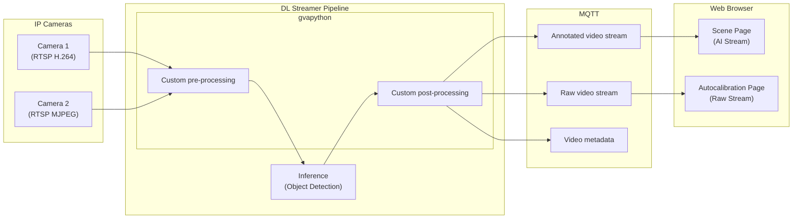
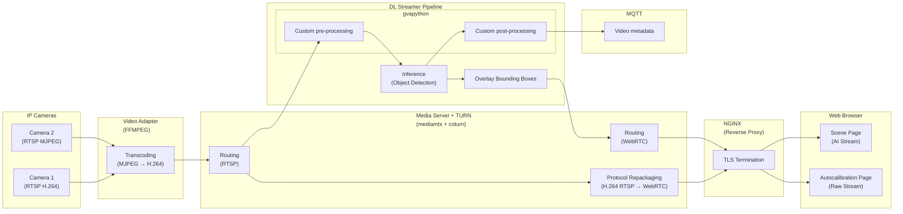
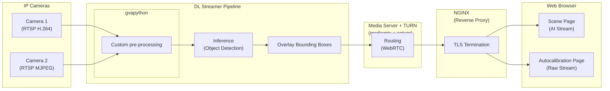
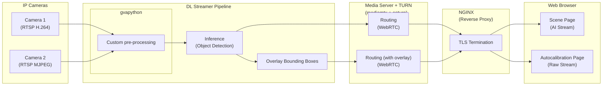

# Design Document: Using WebRTC for Video Streaming

- **Author(s)**: [Patryk Iracki](https://github.com/Irakus)
- **Date**: 2025-09-15
- **Status**: [Proposed]
- **Related ADRs**: N/A

---

## 1. Overview

Replacing the current video streaming from MQTT-based to WebRTC-based to improve performance and user experience.

## 2. Goals

- Stop publishing video frames over MQTT
- Implement WebRTC for video streaming
- Reduce latency for each stream
- Reduce resource consumption on DLStreamer Pipeline Server

## 3. Non-Goals

- Using WebRTC for calibration service
- Removing Python script from DLStreamer pipeline - Preprocessing will still be used, for Postprocessig only images publishing for calibration will be kept

## 4. Background / Context

### Current Design

As of now, MQTT was used as single channel for all data, including video frames. This approach has several drawbacks:

- High latency due to MQTT protocol overhead
- Increased CPU and memory usage on the server side - it's only assumption, need benchmark for exact numbers
- Scalability issues with multiple concurrent video streams
  To achieve this, there's a custom python script used in DLStreamer pipeline that takes raw video frames, draws overlays and watermarks, encodes them to JPEG and publishes to MQTT broker. On the client side, the web application subscribes to the MQTT topic, decodes JPEG frames and displays them in an HTML image and canvas elements. This approach is not optimal for real-time video streaming due to the overhead of encoding/decoding and the limitations of MQTT for high-frequency data transmission.
- Even though the current solution is not optimal and efficient, it ensures that all data is synchronised since it's transmitted over a single channel.
- Another positive aspect is reliability of MQTT protocol, which ensures that all messages are delivered, even in case of temporary network issues. This is particularly important for scenarios where data integrity is crucial.

## 5. Proposed Design

### New components

- **MediaMTX**: An open-source media server that supports various streaming protocols, including WebRTC. It will handle the WebRTC connections and stream routing.
- **FFMPEG-based adapter**: A lightweight component that will convert camera streams to a WebRTC-compatible format with `zerolatency` tuning.
- **NGINX as a reverse proxy**: To handle TLS termination and provide a secure connection for Web app.
- **COTURN**: WebRTC connection requires a TURN server for NAT traversal in some network configurations. This can be set up using open-source solutions like Coturn.

### Key changes

- In python script, only frames needed for autocalibration will be published to MQTT as they're only transmitted one-time and on demand when autocalibration button is pressed by user.
- MediaMTX server will be used to handle WebRTC connections.
- On the client side, the web application will establish a WebRTC connection to MediaMTX server to receive video streams. This will involve setting up signaling, ICE candidates, and media tracks.
- Overlays and watermarks provided by custom Python Script will be dropped. Instead, native DLStreamer bounding boxes will be used.
  Live-view button will be replaced from Scene Details as WebRTC stream is not that easy to start/stop as MQTT stream. Instead, live-view will be always active when user is on Scene Details page.
- For raw camera feed, as they're already available in MediaMTX server, at least a consistent naming convention will be needed, as web app only knows topic names of DLStreamer output streams.
- With MQTT there were no requirements for video format, as each frame was encoded to JPEG image. With WebRTC, video codec must be supported by both MediaMTX server and web browsers. Videos can no longer contain b-frames.
- Nginx will be added as a reverse proxy in front of MediaMTX server to handle TLS termination and provide a secure connection for Web app.
  For browser to connect to MediaMTX server, a valid TLS certificate must be used. Instead of accepting insecure connection in browser, user guide should include instructions on how to import Scenescape CA certificate.
- TURN server will be set up using Coturn to ensure WebRTC connections can be established in various network configurations.

## 6. Alternatives Considered

### Displaying DLStreamer output in all places

#### New components

- **MediaMTX**: An open-source media server that supports various streaming protocols, including WebRTC. It will handle the WebRTC connections and stream routing.
- **NGINX as a reverse proxy**: To handle TLS termination and provide a secure connection for Web app.
- **COTURN**: WebRTC connection requires a TURN server for NAT traversal in some network configurations. This can be set up using open-source solutions like Coturn.

#### Key changes

- No adapter component is needed, as DLStreamer will handle all camera formats.
- No change in currently supported video formats
- DLStreamer will output only one video stream per camera, with bounding boxes overlayed. This means Camera calibration page will also show bounding boxes, which may be distracting for user.

### Splitting streams in DLStreamer Pipeline Server

#### New components

- **MediaMTX**: An open-source media server that supports various streaming protocols, including WebRTC. It will handle the WebRTC connections and stream routing.
- **NGINX as a reverse proxy**: To handle TLS termination and provide a secure connection for Web app.
- **COTURN**: WebRTC connection requires a TURN server for NAT traversal in some network configurations. This can be set up using open-source solutions like Coturn.

#### Key changes

- No adapter component is needed, as DLStreamer will handle all camera formats.
- No change in currently supported video formats
- DLStreamer would split the stream into two before applying watermarks. This would allow us to use different streams for Scene and Autocalibration pages.

#### Issues

- Although DLStreamer supports split pipelines, DLSPS doesn't as it only accepts one destination in payload. An experiment showed that it only used last defined appsink as output. Update in DLSPS would be needed to support multiple outputs.

### Staying with current implementation

Staying with MQTT: for few cameras and low frame rates, MQTT might be sufficient, but it doesn't scale well with more cameras and higher frame rates.

## 7. Risks and Mitigations

- When video is out of user view, browsers stop buffering it. Reconnection can take a while - subject for further discussion
- Lost synchronization between video and other dlstreamer data - subject for further discussion
- Only DLStreamer output topics are known to web app - raw camera feed topic naming convention must be established
- WebRTC is less reliable at delivering every single frame compared to MQTT - subject for further discussion
- WebRTC has more strict requirements for video format - Adding ffmpeg-based adapter component for connecting cameras to ensure WebRTC-compatible video format

## 8. Rollout / Migration Plan

Upgrade from current version would require user to restart DLStreamer Pipelines and Web App.
Inference is not affected by this change, so no retraining of models is needed.
Persistent data is not affected by this change, so no migration of database is needed.
With new component, system requirements will increase, so server specs must be checked to ensure they meet the new requirements.

## 9. Testing & Monitoring

### Video format support

With the adapter, it is essential to ensure that all currently supported camera formats are compatible and can be processed correctly.

### Performance Improvements

A setup involving numerous cameras and/or higher frame rates is required to effectively observe performance improvements.

## 10. Open Questions

### Video Formats

WebRTC has limited support on Video Codecs which may also vary between browsers.
Documenation for supported codecs:

- https://www.rfc-editor.org/rfc/rfc7742.txt
- https://developer.mozilla.org/en-US/docs/Web/Media/Guides/Formats/WebRTC_codecs

Overview:

- Mandatory (Must Support)
  - VP8
  - H.264 (Constrained Baseline Profile)
- Optional (May Support)
  - VP9
  - AV1
  - H.265/HEVC (limited browser support)
- Legacy/Deprecated
  - H.264 (other profiles - limited support)
- Browser Support Notes:
  - Chrome/Edge: VP8, H.264, VP9, AV1
  - Firefox: VP8, H.264, VP9, AV1 (experimental)
  - Safari: VP8, H.264, VP9 (limited), H.265 (Safari-specific)

Aside from that, for quick start of transmission, more keyframes are needed. Our sample videos have keyframes every 10 seconds and that causes long delays when starting the stream. Ideal keyframe interval is 1-2 seconds.

### Performance

There are no measurements on how this change would affect SceneScape performance. Benchmarks are needed to run against this change to estimate that.
Also, in production scenarios, UI is disabled, so MQTT-based streaming should not add any overhead which is not true for WebRTC.

## 11. References

- https://www.rfc-editor.org/rfc/rfc7742.txt
- https://developer.mozilla.org/en-US/docs/Web/Media/Guides/Formats/WebRTC_codecs
